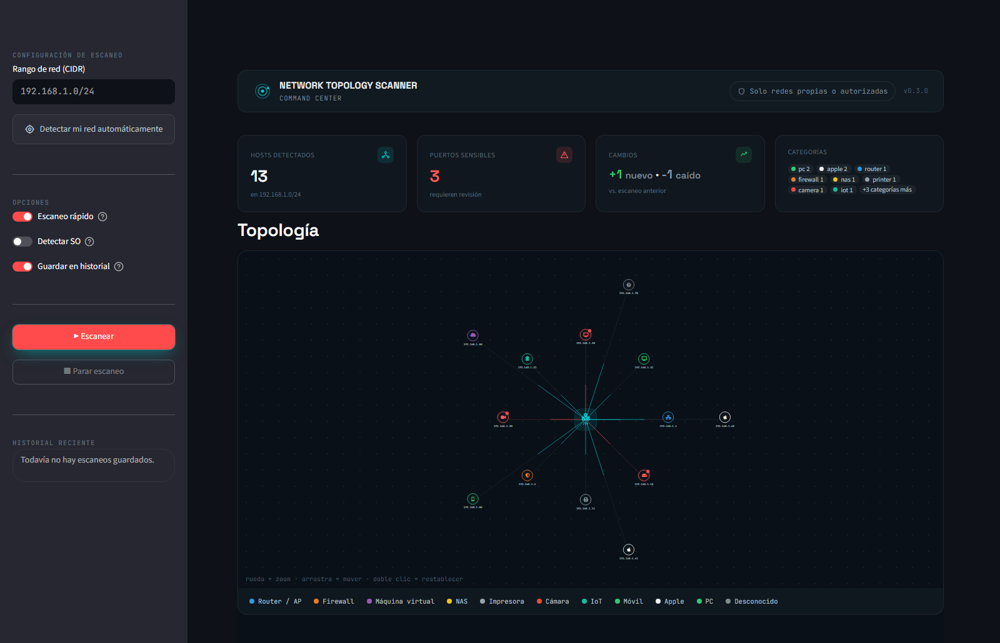
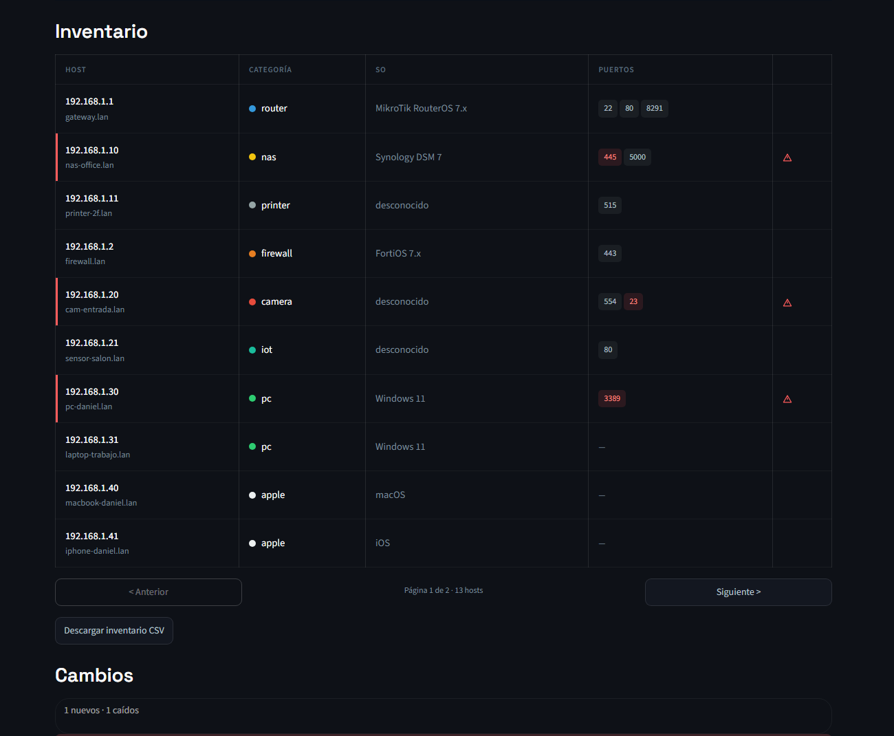

# Network Topology Scanner

[](https://github.com/danielsm107/network-topology-scanner/actions/workflows/ci.yml)

Scans a network range, discovers active hosts, their open ports/services,
vendor (via MAC) and device type, and generates an interactive HTML topology
graph with icons per category (router, PC, NAS, printer, etc). Flags hosts
with sensitive open ports in red (Telnet, SMB, RDP, FTP, VNC), stores every
scan in SQLite to diff against the previous one (new/dropped hosts, ports
that changed), and can export the inventory to CSV. Available as a CLI or as
a local web interface (Streamlit, optional).




*Screenshots use fictional demo data — no real network is exposed here.*

## ⚠️ Legal notice
Only use this tool **on networks you own or have explicit authorization to
scan** (your homelab, or your workplace's network if you have permission).
Scanning networks without consent is illegal in most countries.

## Project structure

```
network-topology-scanner/
├── src/topology_scanner/
│   ├── scanner.py        # nmap scanning (discovery + ports)
│   ├── classifier.py      # Device classification by MAC/vendor
│   ├── graph.py            # Graph construction (networkx)
│   ├── export.py           # HTML export (pyvis), text and CSV
│   ├── history.py          # Scan history in SQLite (diff vs. the previous scan)
│   ├── cli.py               # Command-line interface
│   └── webapp.py            # Web interface (Streamlit, optional)
├── tests/                   # pytest, with nmap mocks (no real network needed)
└── pyproject.toml           # single source of dependencies (pip install -e ".[dev,web]")
```

## Installation

```bash
# System dependency
sudo apt install nmap        # Linux
# On Windows: download the installer from nmap.org

# Virtual environment
python3 -m venv venv
source venv/bin/activate      # Linux/Mac
# venv\Scripts\Activate.ps1   # Windows PowerShell

# Package install (editable mode, includes dev dependencies)
pip install -e ".[dev]"

# Optional, only if you want the web interface
pip install -e ".[web]"
```

## Usage

```bash
sudo topology-scanner 192.168.1.0/24
sudo topology-scanner 192.168.1.0/24 --rapido
sudo topology-scanner 192.168.1.0/24 --con-so --output my_network.html

# Alternative without the installed entry point:
sudo python3 -m topology_scanner 192.168.1.0/24
```

| Flag              | Description                                                     | Default              |
|-------------------|-------------------------------------------------------------------|-----------------------|
| `range`           | CIDR range to scan                                                 | (required)            |
| `--ports`         | Ports to scan (nmap format)                                        | common ports           |
| `--nmap-args`     | Extra arguments passed to nmap                                     | `-sV -T4`             |
| `--output`        | Output HTML file name                                              | `topologia_red.html`  |
| `--con-so`        | Enables OS detection (-O), the slowest option                      | disabled               |
| `--sin-2-fases`   | Disables the preliminary ping scan, scans the full range directly  | disabled               |
| `--rapido`        | Max-speed preset, ports only (incompatible with `--con-so`/`--nmap-args`) | disabled         |
| `--csv`           | Also exports a CSV inventory to the given path                     | disabled               |
| `--history-db`    | SQLite file where scan history is stored                           | `historial.db`         |
| `--sin-historial` | Skips saving the scan to history / diffing against the previous one | disabled              |

## Web interface

Requires the `[web]` extra (see Installation). Form with automatic detection
of your local network, real cancellable scanning (kills the actual nmap
process, not just the UI), results table, CSV download and the embedded
graph.

```bash
topology-scanner-web
# or, without the installed entry point:
streamlit run src/topology_scanner/webapp.py
```

## Device classification

Each host's MAC address is used to look up its vendor (via nmap's built-in
database), which is then heuristically mapped to a category with its own
icon: router, firewall, VM, NAS, printer, camera, IoT, mobile, Apple, PC.

**Limitation**: MAC resolution only works if the scanning machine is on the
**same L2 segment** as the target host (ARP doesn't cross routers/VLANs).
Hosts on other subnets will show up as category "unknown".

## Tests

```bash
pytest tests/ -v
pytest tests/ --cov=topology_scanner   # with coverage
```

`scanner.py` tests use `unittest.mock` to simulate nmap's responses, so they
run without a real network or the nmap binary installed.

## Roadmap

- [x] Visual alerts for sensitive open ports (RDP, Telnet, SMB, FTP, VNC)
- [x] Scan history in SQLite (new/dropped hosts, ports that change)
- [x] CSV export for audits/inventory
- [x] Visual icon/color legend in the HTML
- [x] Web interface with Streamlit
- [x] CI: run tests + ruff on every push
- [ ] Real topology via SNMP against switches/routers (instead of the approximate star layout)
